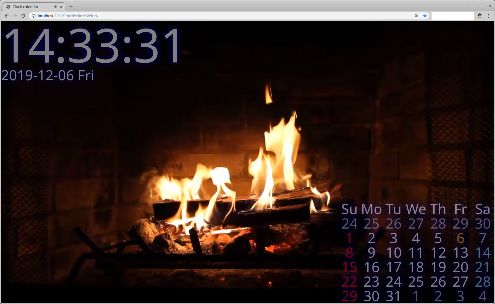

# go 언어로 만든 배경이 있는 시계/달력

go언어의 webassembly 생성 기능을 사용해서 만든 시계/달력 입니다.

build.sh(windows에선 build.ps1) 을 실행하면

파일을 http로 서비스 해줄 dir2http 와
실제 index.html을 통해 로딩되어 시계/달력을 표시해줄 wasmclock.wasm
파일이 생성됩니다.

wasm_exec.js 은 wasm을 로딩해서 실행하는 데 사용 됩니다.
go를 설치하면 /usr/local/go/misc/wasm 폴더에 설치되어 있습니다.  (linux 의 경우 )

dir2http를 실행하면 접속할 클라이언트 url을 보여 줍니다.

    dir2http dir=. port=:8080 http://localhost:8080/

    open bgclock http://localhost:8080/?bgimg=image
    open youtube clock http://localhost:8080/?mvid=youtubeid

클라이언트 접속 URL 에

refresh=페이지리로드간격초 를 주면 주어진 초 마다 페이지를 리로드 합니다. 

bgimg=이미지이름(url) 을 주면 배경그림이 설정되고

mvid=유투브동영상ID 를 주면 배경 동영상이 실행됩니다.

firefox등 요즘 브라우저들은 기본 설정이 자동 재생 금지라서 배경 동영상이 로딩과 동시에 플레이 되게 하고 싶으면 설정을 바꿔 줘야 합니다.

배경을 위해 글자들을 옆으로 치우기전 스크린 샷입니다.

3600초 마다 page reload 하게 되어 있는 이유는 이상하게도 페이지를 오래 (2~3일 정도 ?) 켜두면 멈추는 현상이 발생 하기에 이를 회피 하기 위해서 입니다.