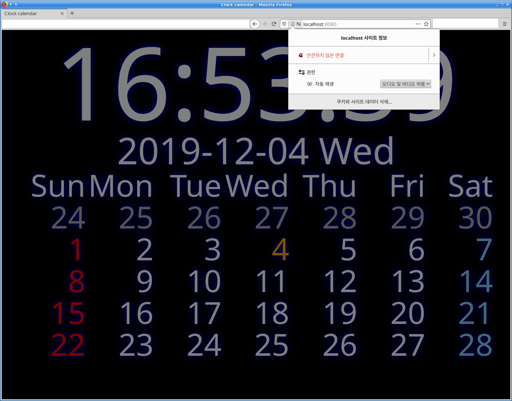

# wasmclockcal

golang wasm clock calendar

go언어로 만든 webassembly 시계 및 달력 입니다. 

3600초 마다 page reload 하게 되어 있는 이유는 이상하게도 페이지를 오래 (2~3일 정도 ?) 켜두면 죽는 현상이 발행하기에 이를 회피 하기 위해서 입니다. 

배경으로 이미지나 유튜브 동영상을 설정할수 있습니다. 

dir2http 로 웹 서버를 실행하면 접속할 클라이언트 url을 보여 줍니다. 

    dir2http dir=. port=:8080 http://localhost:8080/

    open bgclock http://localhost:8080/?bgimg=image
    open youtube clock http://localhost:8080/?mvid=youtubeid

클라이언트 접속 URL 에  

bgimg=이미지이름(url) 을 주면 배경그림이 설정되고 

mvid=유투브동영상ID 를 주면 배경 동영상이 실행됩니다. 

    동영상이 자동 실행되려면 브라우져에서 사이트 설정을 해주어야 합니다. 

